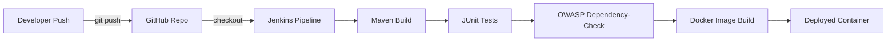
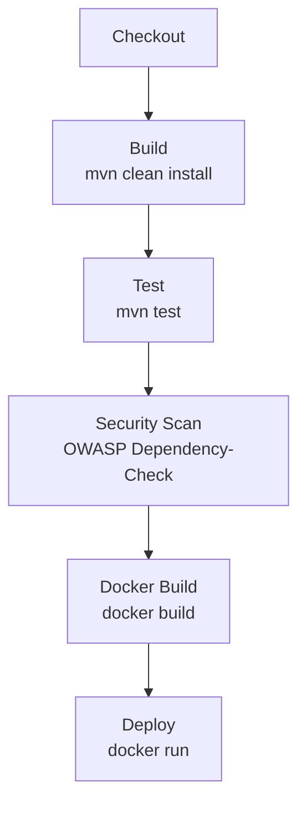

# Jenkins CI/CD Pipeline — DevSecOps Demo

A Spring Boot application delivered through a fully automated Jenkins pipeline: **Build → Test → Security Scan → Docker Build → Deploy** — with security scanning (OWASP Dependency-Check against the NVD database) baked directly into the delivery process.


---

## Overview

This project is a hands-on DevSecOps pipeline built from scratch: a minimal Spring Boot web service, version-controlled on GitHub, automatically built, tested, security-scanned, containerized, and deployed by Jenkins on every push — with zero manual steps.

The goal wasn't just to get a pipeline running, but to understand *why* each stage exists and *how* it works — including debugging every real failure encountered along the way (see [Challenges & Fixes](#challenges--fixes) below).

## Architecture



## Pipeline Stages



| Stage | Tool | What it does |
|---|---|---|
| Checkout | Git | Pulls the latest code from GitHub |
| Build | Maven | Compiles the code and packages it into a `.jar` |
| Test | JUnit 5 + AssertJ | Runs automated tests |
| Security Scan | OWASP Dependency-Check (NVD API) | Scans all dependencies for known CVEs |
| Docker Build | Docker | Packages the app into a container image |
| Deploy | Docker | Runs the image as a live container |

The pipeline follows a **fail-fast** model — if any stage fails, later stages are skipped so problems are caught as early as possible.

## Tech Stack

- **Language / Runtime:** Java 17
- **Framework:** Spring Boot 3.3.0
- **Build Tool:** Apache Maven
- **Testing:** JUnit 5, AssertJ
- **Security Scanning:** OWASP Dependency-Check 12.2.2 (NVD API)
- **Containerization:** Docker
- **CI/CD:** Jenkins (Declarative Pipeline)
- **Source Control:** GitHub

## Project Structure

```
jenkins/
├── src/
│   ├── main/java/com/example/demo/
│   │   └── DemoApplication.java      # Spring Boot app + main entry point
│   └── test/java/com/example/demo/
│       └── basictest.java            # JUnit tests
├── dockerfile                        # Container build instructions
├── jenkinsfile                       # Pipeline definition
└── pom.xml                           # Maven config & dependencies
```

## The Application

A minimal Spring Boot service exposing a single endpoint:

```
GET /hello  →  "Hello from Jenkins pipeline!"
```

Simple by design — its job is to give every pipeline stage something real to build, test, scan, and deploy.

## Running the Pipeline Yourself

### Prerequisites
- Jenkins installed (native install or Docker)
- Docker installed on the same machine Jenkins runs on
- A free [NVD API key](https://nvd.nist.gov/developers/request-an-api-key)

### Setup

1. **Configure Maven** in Jenkins: *Manage Jenkins → Tools → Add Maven* (auto-install), note the name you give it.
2. **Grant Docker permission** to the Jenkins user:
   ```bash
   sudo usermod -aG docker jenkins
   sudo systemctl restart jenkins
   ```
3. **Add your NVD API key** as a Jenkins credential: *Manage Jenkins → Credentials → Add Credentials* → kind `Secret text`, ID `nvd-api-key`.
4. **Create a Pipeline job**, point it at this repository, and set the Jenkinsfile path to `jenkinsfile`.
5. **Run the build.**

### Verifying deployment

```bash
curl http://localhost:8081/hello
# → Hello from Jenkins pipeline!
```

## Security Scan Findings

The Security Scan stage flags real, known CVEs in the project's dependencies (e.g. outdated `spring-boot`, `log4j-api`, `tomcat-embed-core`, `jackson-databind` versions) — a genuine demonstration of the "Sec" in DevSecOps: vulnerabilities are surfaced *before* deployment, not after.

## Challenges & Fixes

Every stage of this pipeline was debugged from a real failure, not assumed working from a tutorial:

| Issue | Root Cause | Fix |
|---|---|---|
| Git fetch failure | Referenced repo didn't exist | Corrected the repo URL |
| Groovy syntax errors | Missing `stage()` names / mismatched `stages`–`stage` nesting | Corrected pipeline structure |
| `mvn: not found` | Maven not installed on the Jenkins agent | Configured Maven via Jenkins Global Tool Configuration |
| Compilation errors | Test file nested inside `main` instead of `test` | Moved to the correct `src/test/java/...` path |
| `Unable to find main class` | Main application file was accidentally emptied | Restored the source code |
| Docker `permission denied` | Jenkins user lacked Docker socket access | Added `jenkins` user to the `docker` group |
| NVD `403/404 Invalid apiKey` | Outdated `dependency-check-maven` version (9.2.0) being blocked by NVD | Upgraded to version 12.2.2 |

## Future Improvements

- Upgrade flagged dependencies (`spring-boot`, `log4j-api`, `tomcat-embed-core`, `jackson-databind`) to patch the CVEs found
- Add Slack/email notifications on pipeline success or failure
- Expand test coverage beyond the placeholder test
- Deploy to a cloud environment instead of a local container
- Add separate staging/production pipelines

## Author

**Prakash Sah** — built as a hands-on DevSecOps learning project.
